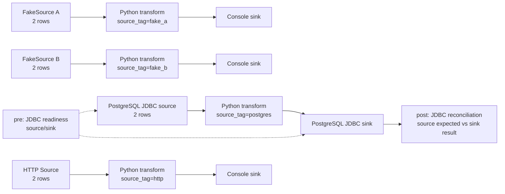
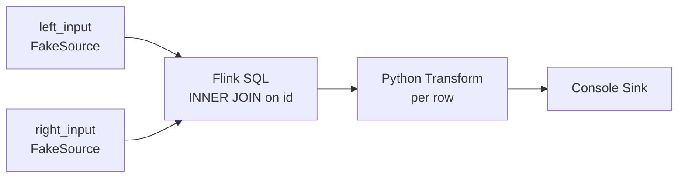

# SeaTunnel Python Transform · Flink 1.20.5 验证案例

这个分支只用于本地验证 SeaTunnel Python transform plugin。范围固定为 Flink 1.20.5、Fake、HTTP、Console、PostgreSQL JDBC 和 Python transform，覆盖多 Source、多 Sink，以及每一行数据经过 Python transform 的场景。

分支：`codex/flink-multi-source-join-workbench`

## 流程



每个 Source 和 Sink 可以通过顶层 `lifecycle` 配置声明前置动作。当前案例在 PostgreSQL source 和 sink 执行 `jdbc_ready`，确认数据库可连接并且 `select 1` 返回 `1`。Flink Job 成功结束后，JDBC sink 执行 `jdbc_recon`，比较源表经过 Python 规则计算后的行数和摘要与目标表结果；比较失败会使 Job 失败。

## 案例文件

- 配置：[python_transform_multi_source_multi_sink.conf](seatunnel-examples/seatunnel-flink-examples/seatunnel-flink-20-example/src/main/resources/examples/python_transform_multi_source_multi_sink.conf)
- Python 脚本：[python_transform.py](seatunnel-examples/seatunnel-flink-examples/seatunnel-flink-20-example/src/main/resources/examples/python_transform.py)
- 本地 HTTP 服务：[http_source_server.py](seatunnel-examples/seatunnel-flink-examples/seatunnel-flink-20-example/src/main/resources/examples/http_source_server.py)

Python transform 对每行数据执行以下规则：`name` 去空格并转小写，`age + 1`，再从 `context["config"]` 读取 `source_tag`。

## PostgreSQL 测试表

连接信息通过环境变量提供，不写入配置文件或 Git：

```bash
export PG_HOST=100.82.226.63
export PG_PORT=30660
export PG_DATABASE=xxt
export PG_USER=root
export PG_PASSWORD='<your-password>'
```

准备测试表和两行输入数据：

```sql
CREATE TABLE IF NOT EXISTS public.seatunnel_python_input (
  id INTEGER PRIMARY KEY,
  name VARCHAR(128) NOT NULL,
  age INTEGER NOT NULL
);

CREATE TABLE IF NOT EXISTS public.seatunnel_python_output (
  id INTEGER PRIMARY KEY,
  name VARCHAR(128) NOT NULL,
  age INTEGER NOT NULL,
  normalized_name VARCHAR(128),
  age_plus_one INTEGER,
  source_tag VARCHAR(64)
);

TRUNCATE public.seatunnel_python_input, public.seatunnel_python_output;
INSERT INTO public.seatunnel_python_input (id, name, age)
VALUES (301, 'Eve', 28), (302, 'Frank', 35);
```

## 定向编译

只编译本案例需要的模块，不构建全仓库发行包：

```bash
./mvnw -pl \
  seatunnel-connectors-v2/connector-fake,\
  seatunnel-connectors-v2/connector-console,\
  seatunnel-connectors-v2/connector-http/connector-http-base,\
  seatunnel-connectors-v2/connector-jdbc,\
  seatunnel-translation/seatunnel-translation-flink/seatunnel-translation-flink-20,\
  seatunnel-core/seatunnel-flink-starter/seatunnel-flink-20-starter,\
  seatunnel-examples/seatunnel-flink-examples/seatunnel-flink-20-example \
  -am -Dflink.1.20.1.version=1.20.5 -DskipTests package
```

Python transform 由 Flink worker 继承的 JVM 参数开启：

```yaml
env.java.opts.all: >-
  -Dseatunnel.transform.python.enabled=true
  -Dseatunnel.transform.python.allowed-executables=/opt/homebrew/bin/python3
```

## 本地运行

复制 Python 脚本，并启动本地 HTTP Source：

```bash
cp seatunnel-examples/seatunnel-flink-examples/seatunnel-flink-20-example/src/main/resources/examples/python_transform.py \
  /tmp/seatunnel-python-transform.py
python3 seatunnel-examples/seatunnel-flink-examples/seatunnel-flink-20-example/src/main/resources/examples/http_source_server.py
```

运行目录需要包含 `starter/seatunnel-flink-20-starter.jar`、Fake/HTTP/Console/JDBC/Transform connector、Flink 1.20 translation jar、PostgreSQL JDBC driver，以及案例配置。提交 Job：

```bash
export FLINK_HOME=/Users/xujiawei/software/flink/flink-1.20.5
export SEATUNNEL_HOME=/path/to/seatunnel-python-transform-runtime
export FLINK_CONF_DIR=$SEATUNNEL_HOME/flink-conf

$SEATUNNEL_HOME/bin/start-seatunnel-flink-20-connector-v2.sh \
  --master local \
  --deploy-mode run \
  -c $SEATUNNEL_HOME/config/python_transform_multi_source_multi_sink.conf \
  --name PythonTransformLifecycleSmoke
```

## 本次结果

在本机 Flink 1.20.5、局域网 PostgreSQL 和本地 HTTP 服务上完成了一次真实运行：

- Job exit code：`0`
- `SourceReceivedCount = 8`：Fake 4 行、PostgreSQL 2 行、HTTP 2 行
- `SinkWriteCount = 8`：三个 Console 分支和一个 PostgreSQL 分支
- PostgreSQL `jdbc_ready` 在 Job 前执行；`jdbc_recon` 在 Job 成功后执行，结果相等才返回成功
- PostgreSQL sink 结果：

```text
301,Eve,28,eve,29,postgres
302,Frank,35,frank,36,postgres
```

## 私有本地包

本次生成的私有压缩包只包含 Flink 1.20.5 运行所需的本案例模块和连接器：

```text
seatunnel-dist/target/seatunnel-dist-private-3.0.0-SNAPSHOT.tar.gz
seatunnel-dist/target/seatunnel-dist-private-3.0.0-SNAPSHOT.tar.gz.sha256
```

包内额外提供 `config/http_source_server.py` 和 `config/seatunnel-env.sh`。启动 HTTP 服务后，使用包内 launcher 即可运行同一个配置。

## 限制

- 当前案例使用 Flink BATCH、单并行度和本地 HTTP 服务，目标是验证插件链路，不是生产部署模板。
- 生命周期动作目前提供 `jdbc_ready`、`jdbc_sql` 和 `jdbc_recon`；`jdbc_recon` 只允许放在 `post` 阶段，并比较单行聚合结果。
- 全仓库发行包、Flink 1.20 以下版本和未列出的 connector 不在本次构建范围内。

## 多 Source SQL JOIN POC

SQL 试验位于当前分支，输入表数量由配置中的 SQL 自己决定，输出固定为一个 SeaTunnel 表。当前案例使用两路 FakeSource 验证 Flink 1.20.5 的 SQL `INNER JOIN`：



配置示例：[python_transform_two_source_inner_join.conf](seatunnel-examples/seatunnel-flink-examples/seatunnel-flink-20-example/src/main/resources/examples/python_transform_two_source_inner_join.conf)。SQL 阶段复用 SeaTunnel 已创建的 `StreamExecutionEnvironment`，执行顺序为 `Source → SQL → Python Transform → Sink`，仍然只提交一个 Flink Job。后续增加第三路或更多输入时，只需要增加 Source 和 SQL 中的表引用。

本地 Flink 1.20.5 运行结果：Job exit code 为 `0`，JobID 为 `670d5ecb79faa23f1af4d5bf1d08a48f`，`SourceReceivedCount = 4`、`SinkWriteCount = 2`。两路 FakeSource 各发送两行，SQL 按 `id` 关联得到两行，再交给 Python Transform；Python 输出字段为 `normalized_name`、`age_plus_one`、`source_tag`。

两行结果的确定性内容为：

```text
301 | Eve   | 28 | Finance | 1 | eve   | 29 | joined
302 | Frank | 35 | HR      | 2 | frank | 36 | joined
```

有限的 FakeSource 验证使用 `job.mode = "BATCH"`，SQL 输入按 append-only DataStream 注册；`STREAMING` 模式则使用 changelog DataStream，保留 `INSERT/UPDATE_BEFORE/UPDATE_AFTER/DELETE` 语义。流式普通 JOIN 是持续运行的状态算子，不能用有限 FakeSource 的“自动结束”作为流式 JOIN 的验收条件。当前 POC 尚未覆盖 PostgreSQL CDC、时间窗口、状态 TTL 和多级 Join 的恢复语义。
