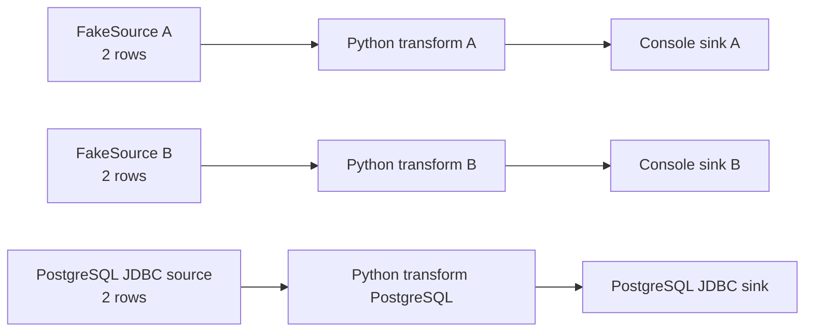

# SeaTunnel Python Transform · Flink 1.20.5 验证案例

这个分支只保留一个用于本地验证的案例：在 Flink 1.20.5 上验证 SeaTunnel Python transform plugin，覆盖多 Source、多 Sink，以及每一行数据经过 Python transform 的场景。

分支：`codex/python-transform-flink20-smoke`

## 方案

- Source：两个 `FakeSource`，一个 PostgreSQL JDBC source
- Transform：三个 Python transform，分别处理两个 Fake 流和 PostgreSQL 流
- Sink：两个 `Console` sink，一个 PostgreSQL JDBC sink
- Python 处理：`name` 转小写、`age + 1`、从 `context["config"]` 读取 `source_tag`
- Flink：本地 `/Users/xujiawei/software/flink/flink-1.20.5`



## 案例文件

- 配置：[python_transform_multi_source_multi_sink.conf](seatunnel-examples/seatunnel-flink-examples/seatunnel-flink-20-example/src/main/resources/examples/python_transform_multi_source_multi_sink.conf)
- Python 脚本：[python_transform.py](seatunnel-examples/seatunnel-flink-examples/seatunnel-flink-20-example/src/main/resources/examples/python_transform.py)

## PostgreSQL 测试表

连接信息通过环境变量提供，不写入配置文件或 Git：

```bash
export PG_HOST=100.82.226.63
export PG_PORT=30660
export PG_DATABASE=xxt
export PG_USER=root
export PG_PASSWORD='<your-password>'
```

本案例使用专用测试表：

```sql
CREATE TABLE IF NOT EXISTS public.seatunnel_python_input (
  id INTEGER PRIMARY KEY,
  name VARCHAR(128) NOT NULL,
  age INTEGER NOT NULL,
  normalized_name VARCHAR(128),
  age_plus_one INTEGER,
  source_tag VARCHAR(64)
);

INSERT INTO public.seatunnel_python_input (id, name, age)
VALUES (301, 'Eve', 28), (302, 'Frank', 35)
ON CONFLICT (id) DO UPDATE
SET name = excluded.name, age = excluded.age;
```

## 编译

```bash
./mvnw -pl \
  seatunnel-connectors-v2/connector-fake,\
  seatunnel-connectors-v2/connector-console,\
  seatunnel-connectors-v2/connector-jdbc,\
  seatunnel-translation/seatunnel-translation-flink/seatunnel-translation-flink-20,\
  seatunnel-core/seatunnel-flink-starter/seatunnel-flink-20-starter,\
  seatunnel-examples/seatunnel-flink-examples/seatunnel-flink-20-example \
  -am -Dflink.1.20.1.version=1.20.5 -DskipTests package
```

Python transform 当前通过执行策略保护：

```yaml
env.java.opts.all: >-
  -Dseatunnel.transform.python.enabled=true
  -Dseatunnel.transform.python.allowed-executables=/opt/homebrew/bin/python3
```

提交 Job 前，将脚本复制到配置中的路径：

```bash
cp seatunnel-examples/seatunnel-flink-examples/seatunnel-flink-20-example/src/main/resources/examples/python_transform.py \
  /tmp/seatunnel-python-transform.py
```

运行目录需要包含：

- `starter/seatunnel-flink-20-starter.jar`
- `connectors/` 下的 Fake、Console、JDBC 和 `seatunnel-transforms-v2.jar`
- `lib/` 下的 Flink 1.20 translation jar
- PostgreSQL JDBC driver
- `config/python_transform_multi_source_multi_sink.conf`

提交命令：

```bash
export FLINK_HOME=/Users/xujiawei/software/flink/flink-1.20.5
export SEATUNNEL_HOME=/path/to/seatunnel-runtime
export FLINK_CONF_DIR=$SEATUNNEL_HOME/flink-conf

$SEATUNNEL_HOME/bin/start-seatunnel-flink-20-connector-v2.sh \
  --master local \
  --deploy-mode run \
  -c $SEATUNNEL_HOME/config/python_transform_multi_source_multi_sink.conf \
  --name PythonTransformSmoke
```

## 验证结果

本地 Flink 1.20.5 Job 成功完成：

- `SourceReceivedCount = 6`：Fake 4 行 + PostgreSQL 2 行
- `SinkWriteCount = 6`
- Python transform 定向单测：24 个全部通过
- PostgreSQL 结果：

```text
301,Eve,28,eve,29,postgres
302,Frank,35,frank,36,postgres
```

其中每行数据都经过了 Python transform，`normalized_name`、`age_plus_one` 和 `source_tag` 均写入成功。

## 当前限制

当前 JDBC sink 在 `generate_sink_sql = true` 时，会根据 JDBC source 的物理表名推导目标表名。本案例因此把转换后的字段写回专用测试表 `seatunnel_python_input`。如果需要独立的 source 表和 sink 表，需要进一步调整 JDBC sink 的表名解析逻辑。

全仓库 `verify` 还没有作为本案例的验收依据：Maven 在解析全量 reactor 依赖时长时间等待远端仓库下载；本案例使用定向编译、Python 单测和真实 Flink/PG 运行作为验证证据。
