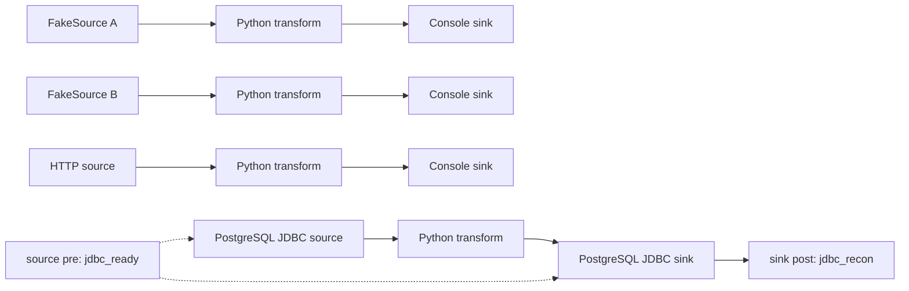
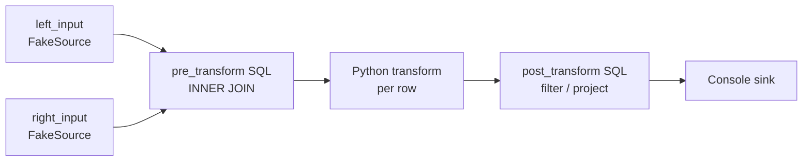

# SeaTunnel Python Transform · Flink 1.20.5 验证分支

这个分支用于在本地验证 SeaTunnel Python transform plugin，以及在一个 Flink 1.20.5 Job 中组合多 Source、多 Sink、SQL JOIN、Python transform 和 Source/Sink 前后置动作。

当前分支：`codex/flink-multi-source-join-workbench`

本次只编译和验证以下连接器：Fake、HTTP、Console、PostgreSQL JDBC。其他连接器不在本分支的验证范围内。

## 验证目标

这里包含两个相互独立的案例：

| 案例 | Source / Transform / Sink | 目的 |
| --- | --- | --- |
| 多 Source、多 Sink 生命周期案例 | Fake、HTTP、PostgreSQL JDBC → Python transform → Console、PostgreSQL JDBC | 验证每行数据经过 Python 处理，以及 JDBC source/sink 的 `pre`、`post` 动作 |
| 多 Source SQL JOIN 案例 | 两路 FakeSource → `pre_transform` SQL `INNER JOIN` → Python transform → `post_transform` SQL → Console | 验证一个 SeaTunnel Flink Job 内由 SQL 组织多输入，并在 Python transform 前后继续处理数据 |

两个案例都使用 Flink 1.20.5、本地 `BATCH` 模式和单并行度，目标是验证实现链路，不是生产部署模板。

## 架构流程

### 多 Source、多 Sink 与生命周期动作



`lifecycle.source.<plugin_output>.pre` 在对应 Source 创建前执行，`lifecycle.sink.<plugin_input>.pre` 在对应 Sink 创建前执行，`lifecycle.sink.<plugin_input>.post` 在 Flink Job 成功结束后执行。当前案例使用 `jdbc_ready` 检查 PostgreSQL 连通性和 `select 1`，使用 `jdbc_recon` 比较源表和目标表的行数及摘要；校验失败会让任务失败。

### SQL JOIN、Python transform 和后置 SQL



SQL 阶段复用 SeaTunnel 已创建的 Flink `StreamExecutionEnvironment`，整个链路只提交一个 Flink Job：

```text
Source → pre_transform SQL → Python Transform → post_transform SQL → Sink
```

输入数量由 SQL 中引用的表决定；增加第三路或更多输入时，增加 Source 并在 SQL 中引用对应的表即可，输出仍然是一个 SeaTunnel 表。

## 案例文件

- 生命周期配置：[python_transform_multi_source_multi_sink.conf](seatunnel-examples/seatunnel-flink-examples/seatunnel-flink-20-example/src/main/resources/examples/python_transform_multi_source_multi_sink.conf)
- SQL JOIN 配置：[python_transform_two_source_inner_join.conf](seatunnel-examples/seatunnel-flink-examples/seatunnel-flink-20-example/src/main/resources/examples/python_transform_two_source_inner_join.conf)
- Python 脚本：[python_transform.py](seatunnel-examples/seatunnel-flink-examples/seatunnel-flink-20-example/src/main/resources/examples/python_transform.py)
- 本地 HTTP 服务：[http_source_server.py](seatunnel-examples/seatunnel-flink-examples/seatunnel-flink-20-example/src/main/resources/examples/http_source_server.py)

Python transform 对每行执行以下规则：`name` 去空格并转小写，计算 `age + 1`，再从 `context["config"]` 读取 `source_tag`。

## SQL 阶段配置

SQL JOIN 案例使用显式的嵌套配置：

```hocon
sql {
  pre_transform {
    plugin_output = "joined_input"
    query = "SELECT ... FROM left_input l INNER JOIN right_input r ON l.id = r.id"
  }
}

transform {
  Python {
    plugin_input = "joined_input"
    plugin_output = "joined_python"
    # Python transform 配置省略
  }
}

sql {
  post_transform {
    plugin_output = "filtered_output"
    query = "SELECT ... FROM joined_python WHERE age_plus_one >= 30"
  }
}
```

旧的顶层 `sql { query = ... }` 配置仍然按 `pre_transform` 处理，因此已有配置可以继续运行。`post_transform` 必须显式声明在 `sql.post_transform` 下。

## PostgreSQL 测试表

连接信息通过环境变量提供，不写入配置文件或 Git：

```bash
export PG_HOST=100.82.226.63
export PG_PORT=30660
export PG_DATABASE=xxt
export PG_USER=root
export PG_PASSWORD='<your-password>'
```

准备生命周期案例使用的测试表和数据：

```sql
CREATE TABLE IF NOT EXISTS public.seatunnel_python_input (
  id INTEGER PRIMARY KEY,
  name VARCHAR(128) NOT NULL,
  age INTEGER NOT NULL
);

CREATE TABLE IF NOT EXISTS public.seatunnel_python_output (
  id INTEGER PRIMARY KEY,
  name VARCHAR(128) NOT NULL,
  age INTEGER NOT NULL,
  normalized_name VARCHAR(128),
  age_plus_one INTEGER,
  source_tag VARCHAR(64)
);

TRUNCATE public.seatunnel_python_input, public.seatunnel_python_output;
INSERT INTO public.seatunnel_python_input (id, name, age)
VALUES (301, 'Eve', 28), (302, 'Frank', 35);
```

## 定向编译

只编译本案例所需的模块，不构建全仓库发行包：

```bash
./mvnw -pl \
  seatunnel-connectors-v2/connector-fake,\
  seatunnel-connectors-v2/connector-console,\
  seatunnel-connectors-v2/connector-http/connector-http-base,\
  seatunnel-connectors-v2/connector-jdbc,\
  seatunnel-translation/seatunnel-translation-flink/seatunnel-translation-flink-20,\
  seatunnel-core/seatunnel-flink-starter/seatunnel-flink-20-starter,\
  seatunnel-examples/seatunnel-flink-examples/seatunnel-flink-20-example \
  -am -Dflink.1.20.1.version=1.20.5 -DskipTests -Dskip.spotless=true package
```

Python transform 由 Flink worker 继承的 JVM 参数开启，并限制可执行解释器：

```yaml
env.java.opts.all: >-
  -Dseatunnel.transform.python.enabled=true
  -Dseatunnel.transform.python.allowed-executables=/opt/homebrew/bin/python3
```

本次还执行了以下定向检查：

```bash
./mvnw -pl seatunnel-core/seatunnel-flink-starter/seatunnel-flink-starter-common \
  -Dskip.spotless=true \
  -Dtest=SqlExecuteProcessorTest \
  -Dsurefire.failIfNoSpecifiedTests=false test

./mvnw -pl seatunnel-core/seatunnel-flink-starter/seatunnel-flink-starter-common \
  -DskipTests spotless:check
```

结果：`SqlExecuteProcessorTest` 通过 6 个测试，Spotless 检查通过，Flink 1.20.5 定向构建成功。

## 本地运行

两个案例都需要把 Python 脚本放到配置中的绝对路径：

```bash
cp seatunnel-examples/seatunnel-flink-examples/seatunnel-flink-20-example/src/main/resources/examples/python_transform.py \
  /tmp/seatunnel-python-transform.py

export FLINK_HOME=/Users/xujiawei/software/flink/flink-1.20.5
export SEATUNNEL_HOME=/path/to/seatunnel-python-transform-runtime
export FLINK_CONF_DIR=$SEATUNNEL_HOME/flink-conf
```

运行目录需要包含 Flink 1.20 translation、Flink 20 starter、Python transform、Fake/HTTP/Console/JDBC connector、PostgreSQL JDBC driver 和对应配置文件。

运行多 Source、多 Sink 生命周期案例：

```bash
python3 seatunnel-examples/seatunnel-flink-examples/seatunnel-flink-20-example/src/main/resources/examples/http_source_server.py

$SEATUNNEL_HOME/bin/start-seatunnel-flink-20-connector-v2.sh \
  --master local \
  --deploy-mode run \
  -c $SEATUNNEL_HOME/config/python_transform_multi_source_multi_sink.conf \
  --name PythonTransformLifecycleSmoke
```

运行 SQL JOIN、Python transform、后置 SQL 案例：

```bash
$SEATUNNEL_HOME/bin/start-seatunnel-flink-20-connector-v2.sh \
  --master local \
  --deploy-mode run \
  -c $SEATUNNEL_HOME/config/python_transform_two_source_inner_join.conf \
  --name PythonTransformPrePostSqlPoc
```

## 实际验证结果

### 生命周期案例

在本机 Flink 1.20.5、局域网 PostgreSQL 和本地 HTTP 服务上运行成功：

- Job exit code：`0`
- `SourceReceivedCount = 8`：Fake 4 行、PostgreSQL 2 行、HTTP 2 行
- `SinkWriteCount = 8`：三个 Console 分支和一个 PostgreSQL 分支
- PostgreSQL `jdbc_ready` 在 Job 前执行，`jdbc_recon` 在 Job 成功后执行
- PostgreSQL sink 结果：

```text
301,Eve,28,eve,29,postgres
302,Frank,35,frank,36,postgres
```

### SQL JOIN 案例

在本机 Flink 1.20.5 上运行成功：

- Job exit code：`0`
- JobID：`dcf6c4eef8530dde60da224fc2737d0c`
- `SourceReceivedCount = 4`、`SinkWriteCount = 1`
- 两路 FakeSource 各发送两行，`pre_transform` SQL 按 `id` 关联得到两行
- Python transform 增加 `normalized_name`、`age_plus_one`、`source_tag`
- `post_transform` SQL 过滤出一行

最终 Console 输出：

```text
302 | Frank | 35 | HR | 2 | frank | 36 | joined
```

## 私有包

二进制包不提交到 Git。完成本地 runtime 组装后，私有压缩包和校验文件约定放在：

```text
seatunnel-dist/target/seatunnel-dist-private-3.0.0-SNAPSHOT.tar.gz
seatunnel-dist/target/seatunnel-dist-private-3.0.0-SNAPSHOT.tar.gz.sha256
```

包内只放本案例所需的 Flink 1.20.5 运行文件、连接器、配置和 `config/http_source_server.py`。如果目标路径不存在，需要先完成定向构建和 runtime 组装；仓库本身不追踪该归档文件。

## 代码位置

- Flink 执行顺序和 SQL 阶段：[FlinkExecution.java](seatunnel-core/seatunnel-flink-starter/seatunnel-flink-starter-common/src/main/java/org/apache/seatunnel/core/starter/flink/execution/FlinkExecution.java)
- SQL 阶段解析和执行：[SqlExecuteProcessor.java](seatunnel-core/seatunnel-flink-starter/seatunnel-flink-starter-common/src/main/java/org/apache/seatunnel/core/starter/flink/execution/SqlExecuteProcessor.java)
- SQL 阶段测试：[SqlExecuteProcessorTest.java](seatunnel-core/seatunnel-flink-starter/seatunnel-flink-starter-common/src/test/java/org/apache/seatunnel/core/starter/flink/execution/SqlExecuteProcessorTest.java)

## 限制与未验证项

- 当前 SQL JOIN 验证使用 Flink `BATCH`、单并行度和有限的 FakeSource 数据。
- `STREAMING` 路径保留 `INSERT`、`UPDATE_BEFORE`、`UPDATE_AFTER`、`DELETE` changelog 语义，但本次没有用持续运行的真实流源验收持续 JOIN。
- 本次没有覆盖 PostgreSQL CDC、时间窗口、状态 TTL、checkpoint 恢复、多级 JOIN 或大规模数据。
- `jdbc_recon` 当前比较单行聚合结果；生产环境仍需按业务主键、重复执行和失败恢复策略补充验收。
- Flink 1.20 以下版本、未列出的 connector 和全仓库发行包不在本分支构建范围内。
